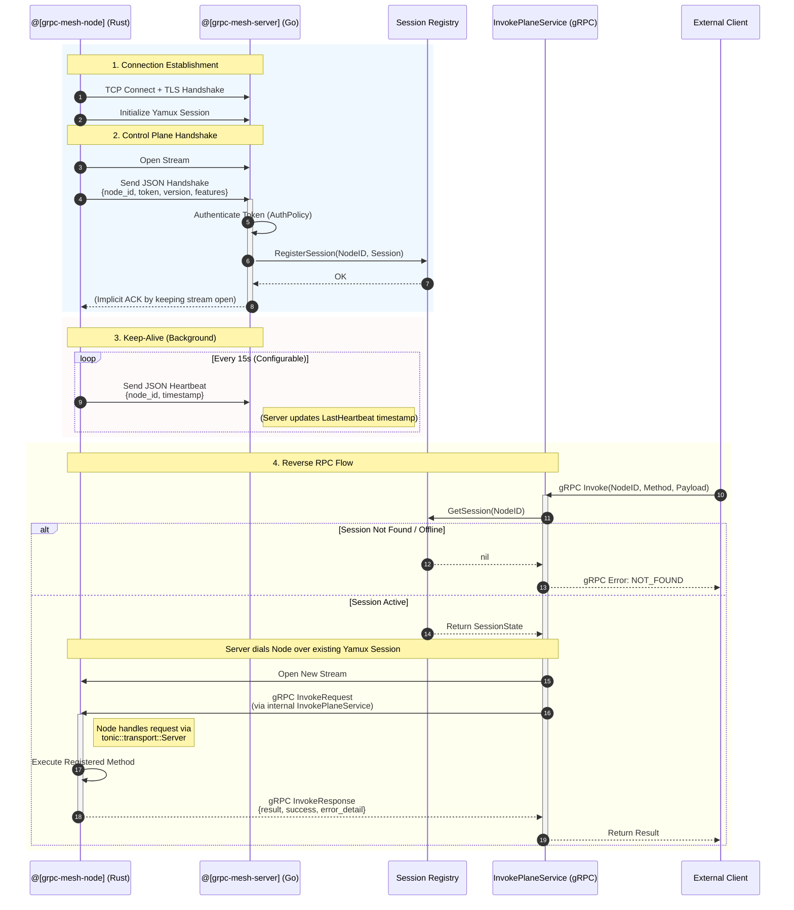

### 参与方说明 (Participants Legend)

这个时序图展示了 **3端 (3-Party)** 交互架构：

1.  **External Client (外部客户端)**
    *   **角色**: 发起方。它是业务逻辑的调用者（例如：一个 HTTP API 网关、CLI 工具、或另一个微服务）。
    *   **行为**: 它不直接连接 Node，而是连接 Server。它发送 "请在 Node A 上执行 Method X" 的指令。
    *   **协议**: gRPC (调用 Server 的 `InvokePlaneService`)。

2.  **grpc-mesh-server (服务端)**
    *   **角色**: 枢纽 / 控制面。
    *   **行为**: 维护所有 Node 的连接（Registry）。当收到 Client 请求时，它充当**反向代理**，找到对应的 Node 会话，并通过 Yamux 隧道将请求转发给 Node。

3.  **grpc-mesh-node (节点)**
    *   **角色**: 服务提供者 / 执行者。
    *   **行为**: 运行在内网或边缘设备上。它主动连接 Server 并保持长连接。当收到 Server 的转发请求时，它执行本地的函数（如 `Calculator.Add`）并返回结果。

> **注意**: 在 `demos/calculator-client` 示例中，"External Client" 和 "grpc-mesh-server" 运行在同一个进程中（Server 被内嵌），但逻辑上它们是两个分层的组件。